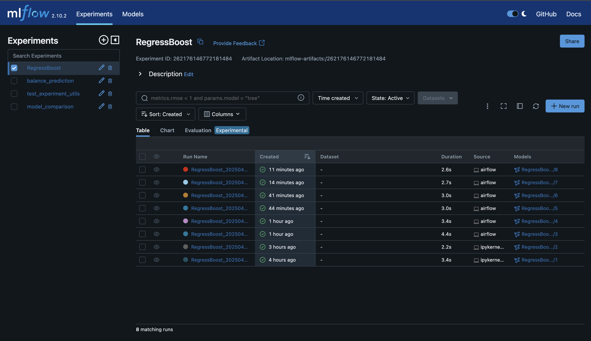
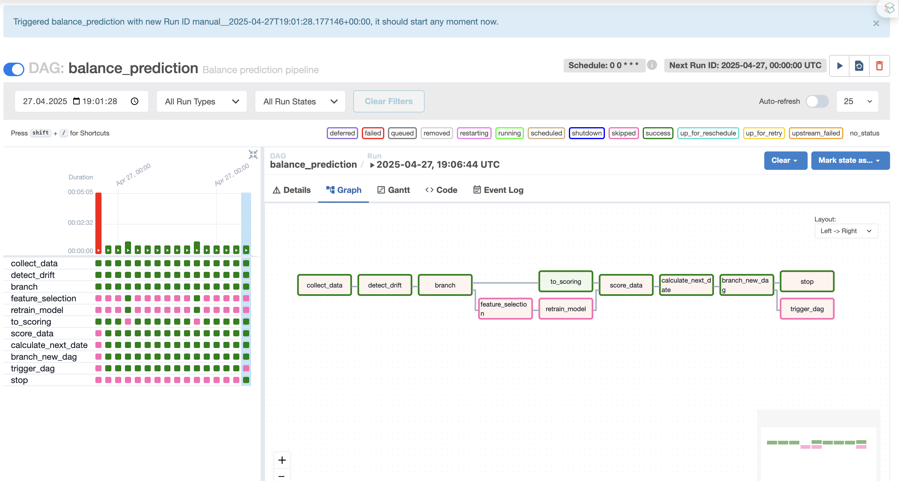

# Balance Predictions ML Project

Проект для предсказания баланса с использованием MLflow для отслеживания экспериментов и хранения моделей в Yandex Cloud S3.

## Требования

- Python 3.9+
- Docker
- Docker Compose
- Доступ к Yandex Cloud S3

## Установка

1. Создайте файл `.env` в корне проекта со следующими переменными:
```bash
AWS_ACCESS_KEY_ID=your_access_key_id
AWS_SECRET_ACCESS_KEY=your_secret_access_key
AWS_DEFAULT_REGION=ru-central1
MLFLOW_S3_BUCKET=your_bucket_name
MLFLOW_S3_ENDPOINT_URL=https://storage.yandexcloud.net
MLFLOW_ARTIFACT_ROOT=s3://your_bucket_name/mlflow
```

2. Создайте виртуальное окружение и активируйте его:
```bash
bash setup_env.sh
source .venv/bin/activate  # для Linux/Mac
# или
.venv\Scripts\activate  # для Windows
```

3. Запустите MLflow сервер:
```bash
docker compose up --build
```


Mlflow привязан к S3 хранилищу на Yandex Cloud для обеспечения доступности экспериментов и обмена данными между участниками команды 

Продакшен эксперимент, где собраны модели для пайплайна: **RegressBoost**

4. MLflow UI будет доступен по адресу: http://localhost:5001

## Запуск Airflow

1. Создайте необходимые директории:
```bash
mkdir -p dags logs plugins config
```

2. Инициализируйте Airflow:
```bash
docker compose -f docker-compose-airflow.yml up airflow-init
```

3. Запустите Airflow:
```bash
docker compose -f docker-compose-airflow.yml up --build
```

4. Airflow UI будет доступен по адресу: http://localhost:8080
   - Логин: airflow
   - Пароль: airflow



Продакшн ДАГ для пайплайна предсказания модели: **balance_prediction**

Структура ДАГа:
   - *collect_data*: сборка фичей на текущую дату. Включает в себя сборку сырых данных внешних признаков, таргет и Feature Engineering, в котором считаются лаговые и другие преобразования для признаков. Результат записывается на S3 хранилище в папку prod 
   - *detect_drift*: оператор поиска дрифта в данных, на выходе возвращается true или false, в зависимости от наличия разладки в данных
   - *branch*: оператор ветвлиния который выбирает два пути: перейти к скорингу или пойти на переобучение в случае если замечена разладка или наступил период переобучения (каждое воскресенье)
   - *feature_selection*: поиск наиболее релевантных признаков. Результат записывается в виде pickle в папку prod
   - *retrain_model*: переобучение модели с оптимизацией параметров на актуальных данных. Модель записывается в продакшн эксперемент на S3 и MLflow
   - *to_scoring*: дамми оператор для того чтобы перейти к скорингу
   - *score_date*: скоринг текущего дня, возврашается значение скора 
   - *calculate_next_date*: оператор вычисления следующего дня для рекурсивного запуска
   - *branch_new_dag*: оператор ветвления - либо останавливает даг, если был достигнуть день остановки, или запуск ДАГа за следующий день
   - *trigger_dag*: триггер оператор, запускает ДАГ за следующий день снова. Нужен для ретро-тестирования 
   - *stop*: остановка выполнения 

AirFlow интегрирован в общей сети с MLflow и имеет доступ к чтению и созданию моделей
## Структура проекта

```
balance_predictions/
├── .env                         # Переменные окружения
├── .gitignore                   # Список игнорируемых git-файлов
├── Dockerfile                   # Базовый образ для MLflow
├── Dockerfile.airflow           # Образ для Airflow
├── docker-compose.yml           # Композиция MLflow
├── docker-compose-airflow.yml   # Композиция для Airflow
├── README.md                    # Этот файл
├── requirements.txt             # Python-зависимости
├── setup_env.sh                 # Скрипт инициализации окружения
├── setup.py                     # Установочный скрипт пакета
│
├── config/                      # Конфигурационные файлы
│   └── …                         
│
├── dags/                        # Airflow DAGs
│   └── …                         
│
├── data/                        # Данные (raw, interim, processed)
│   └── …                         
│
├── images/                      # Вспомогательные изображения
│   └── …                         
│
├── logs/                        # Логи запуска (Airflow, скрипты)
│   └── …                         
│
├── mlruns/                      # Эксперименты MLflow
│   └── …                         
│
├── notebooks/                   # Jupyter-блокноты для анализа и отладки
│   └── …                         
│
├── src/                         # Исходный код пакета
│   ├── balance_predictions.egg-info/
│   ├── prod/                    # Производственные модули
│   │   ├── __pycache__/
│   │   ├── operators/           # Операторы Airflow
│   │   │   ├── __pycache__/
│   │   │   ├── __init__.py
│   │   │   ├── data_collection.py        # Task для сбора признаков data_collection
│   │   │   ├── drift_detection.py        # Task для поиска разладок drift_detection
│   │   │   ├── feature_selection.py      # Task для отбора релевантных признаков feature_selection
│   │   │   ├── model_training.py         # Task для переобучения модели retrain_model
│   │   │   ├── scoring.py                # Task для скоринга score_data
│   │   │   └── __init__.py
│   │   ├── drift_detector.py
│   │   ├── feature_engineering.py
│   │   ├── feature_selection.py
│   │   ├── metric.py
│   │   └── utils.py
│   └── __init__.py
│   
│
└── tests/                       # Юнит-тесты и интеграционные тесты
```

### Описание компонентов

- `src/`: Исходный код проекта
  - `utils.py`: Утилиты для работы с MLflow (инициализация, логирование, получение результатов)
  
- `tests/`: Тесты и примеры использования
  - `test_mlflow_utils.py`: Тесты для проверки функциональности утилит
  - `test_mlflow_example.py`: Пример использования MLflow с реальными данными

- `dags/`: DAG'и Airflow
  - `test_mlflow_dag.py`: Пример DAG'а для тестирования моделей из MLflow

- `logs/`: Логи выполнения задач Airflow

- `plugins/`: Пользовательские плагины для расширения функциональности Airflow

- `config/`: Конфигурационные файлы для настройки компонентов

- Docker файлы:
  - `Dockerfile`: Конфигурация контейнера MLflow
  - `docker-compose.yml`: Настройка сервисов MLflow
  - `docker-compose-airflow.yml`: Настройка сервисов Airflow

- Конфигурационные файлы:
  - `requirements.txt`: Зависимости Python
  - `setup.py`: Конфигурация пакета
  - `.env`: Переменные окружения (не включены в репозиторий)

## Хранение данных

- Метаданные экспериментов хранятся в MLflow
- Модели и артефакты хранятся в Yandex Cloud S3
- Локальные копии артефактов хранятся в директории `mlruns/`

## Устранение неполадок

1. Если MLflow не запускается:
   - Проверьте, что порт 5001 свободен
   - Проверьте логи Docker контейнера: `docker-compose logs`

2. Если файлы не сохраняются в S3:
   - Проверьте учетные данные в .env
   - Убедитесь, что бакет существует и доступен
   - Проверьте права доступа к бакету

3. Если возникают проблемы с импортом:
   - Убедитесь, что пакет установлен: `pip install -e .`
   - Проверьте активацию виртуального окружения

## Работа с Airflow

### Структура DAG
```python
from datetime import datetime, timedelta
from airflow import DAG
from airflow.operators.python import PythonOperator

default_args = {
    'owner': 'airflow',
    'depends_on_past': False,
    'email_on_failure': False,
    'email_on_retry': False,
    'retries': 1,
    'retry_delay': timedelta(minutes=5),
}

with DAG(
    'your_dag',
    default_args=default_args,
    description='Описание DAG',
    schedule_interval=timedelta(days=1),
    start_date=datetime(2024, 1, 1),
    catchup=False,
) as dag:
    
    task = PythonOperator(
        task_id='task_name',
        python_callable=your_function,
    )
```

### Мониторинг DAG
1. Откройте Airflow UI (http://localhost:8080)
2. Найдите ваш DAG в списке
3. Используйте кнопки для управления DAG:
   - Trigger DAG - запустить DAG вручную
   - Pause/Unpause - приостановить/возобновить DAG
   - Graph View - просмотр графа задач
   - Tree View - просмотр истории запусков

### Логирование
- Логи задач доступны в Airflow UI
- Логи MLflow доступны в MLflow UI
- Файлы логов находятся в директории `logs/`

## Взаимодействие MLflow и Airflow

1. Airflow использует MLflow для:
   - Загрузки моделей
   - Логирования экспериментов
   - Хранения артефактов

2. MLflow хранит:
   - Модели
   - Метрики
   - Параметры
   - Артефакты

3. Пример использования в DAG:
```python
def test_model():
    init_mlflow(
        tracking_uri='http://host.docker.internal:5001',
        experiment_name="test_experiment",
        s3_bucket="balance-predictions"
    )
    
    artifacts = get_artifacts_by_run_name("model_run", "test_experiment")
    model = artifacts["model"]
    
    # Использование модели
    predictions = model.predict(data)
    
    # Логирование результатов
    log_experiment(
        model=model,
        model_name="test_model",
        metrics={"accuracy": 0.95},
        artifacts={"predictions": predictions}
    )
```

## Устранение неполадок

1. Если MLflow недоступен:
   - Проверьте, запущен ли контейнер MLflow
   - Проверьте порт 5001
   - Проверьте переменные окружения

2. Если Airflow недоступен:
   - Проверьте, запущены ли все контейнеры Airflow
   - Проверьте порт 8080
   - Проверьте логи контейнеров

3. Если DAG не запускается:
   - Проверьте синтаксис DAG
   - Проверьте зависимости
   - Проверьте логи задач

4. Если модель не загружается:
   - Проверьте имя эксперимента
   - Проверьте имя запуска
   - Проверьте наличие модели в MLflow
